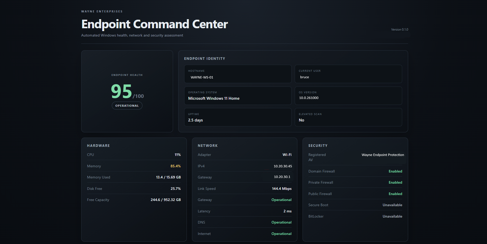
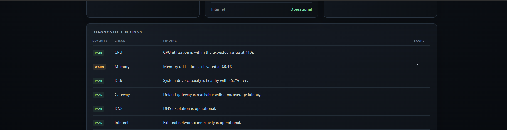

# Wayne Enterprises Endpoint Diagnostic

A PowerShell-based Windows endpoint diagnostic tool that checks system health, networking, and security posture, then generates structured JSON data and a visual HTML dashboard.

I am a big Batman fan and wanted to build something small, practical, and fun that felt like an internal Wayne Enterprises IT tool while still demonstrating Windows, networking, security, and automation skills.

## What It Does

The diagnostic checks:

- CPU, memory, and disk health
- Active network adapter and IPv4 configuration
- Default gateway and latency
- DNS resolution and internet connectivity
- Registered antivirus products
- Windows Firewall profiles
- Microsoft Defender status
- Secure Boot and BitLocker when available
- Administrator privileges

Each check is classified as:

`PASS` | `WARN` | `FAIL` | `INFO`

The tool also calculates an overall endpoint health score and status.

## Dashboard

The generated HTML report presents the scan as a Wayne Enterprises-style endpoint command center.



### Diagnostic Findings

The findings view shows how collected telemetry is interpreted into PASS, WARN, FAIL, and INFO results with score deductions where appropriate.



## Run It

Run the diagnostic:

```powershell
.\Invoke-Wayne.ps1
```

Run the diagnostic and automatically open the HTML command center:

```powershell
.\Invoke-Wayne.ps1 -OpenReport
```

## Workflow

```text
Windows Endpoint
      ↓
Telemetry Collection
      ↓
Diagnostic Engine
      ↓
Health Score + Findings
      ↓
JSON Report
      ↓
HTML Dashboard
```

## Project Structure

```text
wayne-enterprises-diagnostic/
├── docs/
│   └── screenshots/
│       ├── wayne-dashboard.png
│       └── wayne-findings.png
├── reports/
├── src/
│   ├── Invoke-WayneDiagnostic.ps1
│   └── New-WayneHtmlReport.ps1
├── tests/
├── Invoke-Wayne.ps1
├── .gitignore
└── README.md
```

## Tech

- PowerShell
- Windows CIM/WMI
- Windows networking cmdlets
- Microsoft Defender and Firewall cmdlets
- JSON
- HTML/CSS
- Git

## Design

`Invoke-WayneDiagnostic.ps1` collects and evaluates endpoint telemetry.

`New-WayneHtmlReport.ps1` converts the resulting JSON into a browser-based command center.

Checks that cannot be evaluated because of permissions or system configuration are reported as unavailable instead of being incorrectly marked as failures.

Generated diagnostic reports are excluded from Git to avoid publishing endpoint-specific data.

## Version

`v0.1.0`

## Disclaimer

Fan-made portfolio project inspired by Batman and Wayne Enterprises.